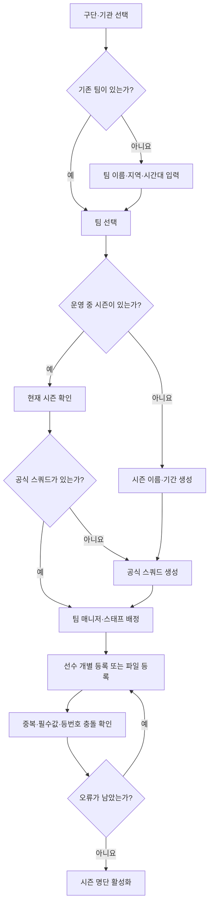
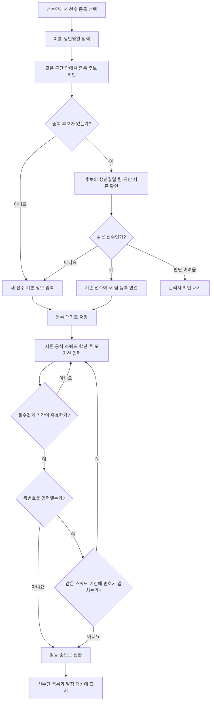
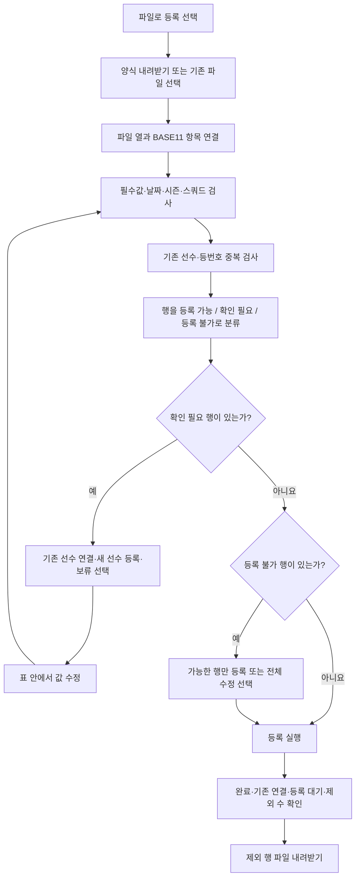
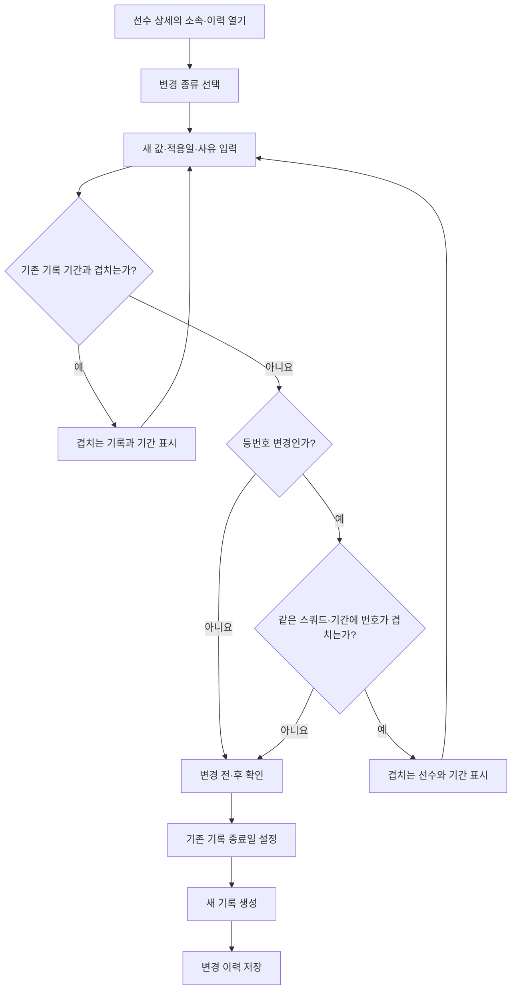
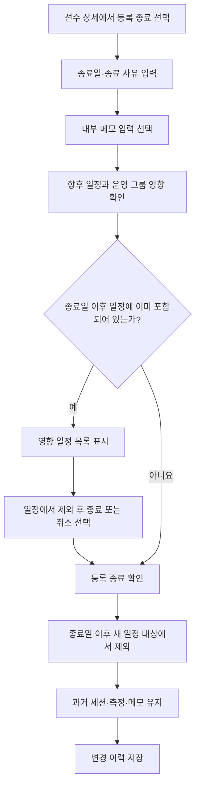
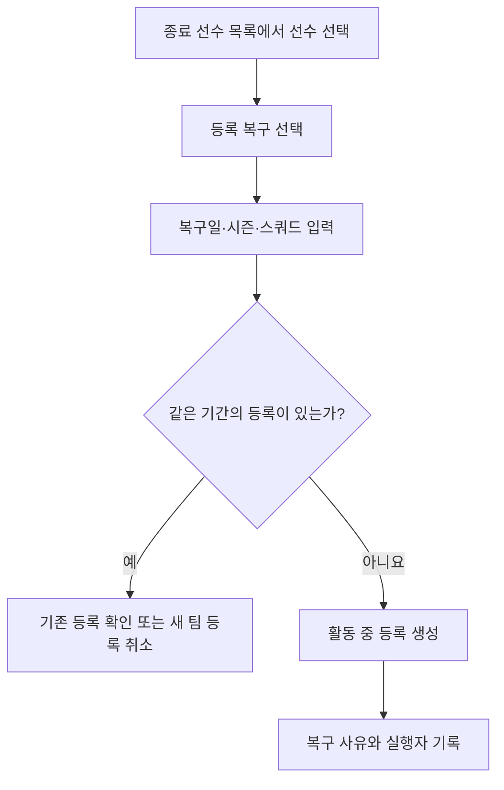
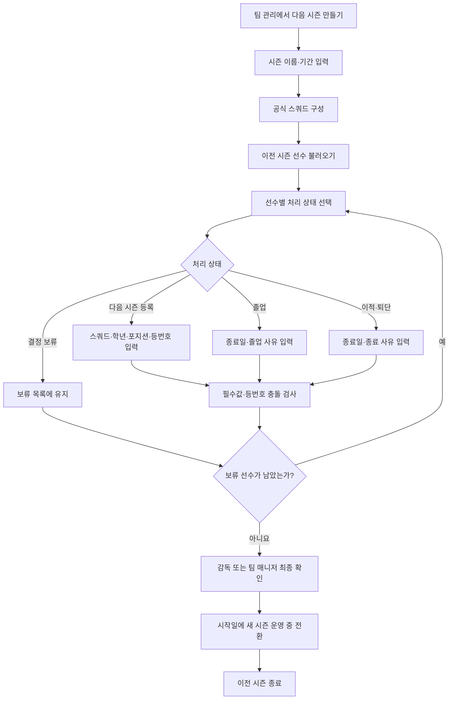
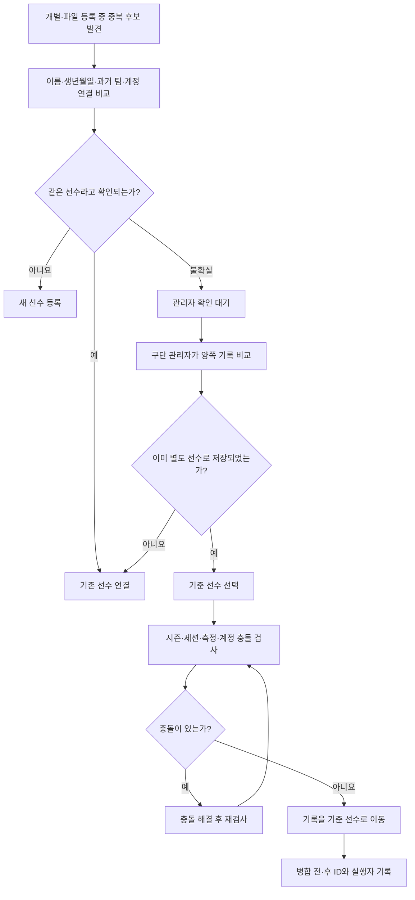
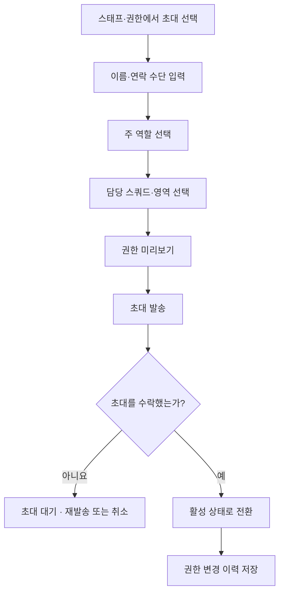
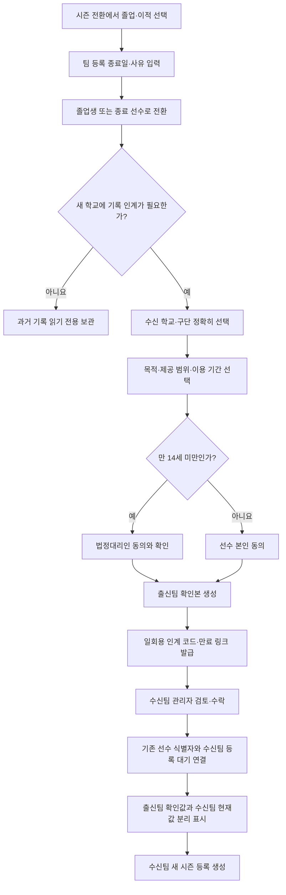

# 팀·선수 관리 플로우

> 상태: 기획 기준안 1.0
> 최종 수정: 2026-08-23
> 상위 정책: [팀·선수 등록 및 관리 정책](./TEAM_PLAYER_MANAGEMENT_POLICY.md)
> 예외 기준: [팀·선수 관리 예외 처리 정책](./TEAM_PLAYER_MANAGEMENT_EXCEPTION_POLICY.md)
> 생애주기·인계 기준: [선수 생애주기·시즌 전환·진학 데이터 정책](./PLAYER_LIFECYCLE_DATA_POLICY.md)
> 상세 기획: [팀·선수 관리 기능 기획서](./TEAM_PLAYER_MANAGEMENT_PRD.md)

## 1. 팀 최초 설정

### 완료 상태

- 운영 중 팀 1개
- 운영 중 시즌 1개
- 공식 스쿼드 1개 이상
- 팀 매니저 또는 감독 1명 이상
- 활동 중 선수 1명 이상

## 2. 선수 개별 등록

### 중단 후 재개

- 기본 정보 저장 후 나가면 `등록 대기`에 남습니다.
- 시즌 명단 입력을 완료할 때까지 일정 대상에는 포함하지 않습니다.
- 관리자 확인 대기 중인 중복 후보는 새 선수로 확정되지 않습니다.

## 3. 선수 파일 등록

### 파일 등록 원칙

- 파일 선택만으로 저장하지 않습니다.
- 모든 행은 검사 결과를 먼저 보여줍니다.
- 등록 가능한 행만 먼저 처리할 수 있습니다.
- 오류가 있는 원본 파일을 덮어쓰지 않습니다.

## 4. 공식 스쿼드·등번호·포지션 변경

### 결과

- 현재 값은 적용일 기준으로 바뀝니다.
- 적용일 전 세션은 이전 소속·번호·포지션을 유지합니다.
- 이미 끝난 시즌을 정정할 때는 구단 관리자 권한이 필요합니다.

## 5. 선수 등록 종료와 복구

### 복구

## 6. 다음 시즌 명단 구성

### 새 시즌에 이어지는 것

- 선수 원본
- 기본 축구 정보
- 같은 구단 안의 팀 등록 이력
- 허용된 연락 정보

### 새 시즌에서 다시 정하는 것

- 공식 스쿼드
- 학년
- 주 포지션 확인
- 등번호
- 학교
- 시즌 등록 상태

## 7. 중복 후보 처리와 병합

중복 후보는 같은 구단 안에서만 찾습니다. 다른 구단의 선수는 검색하거나 연결하지 않습니다.

## 8. 스태프 초대와 권한

팀 매니저는 초대와 비활성화를 처리할 수 있지만 구단 관리자 권한 부여와 중복 선수 병합 권한은 줄 수 없습니다.

## 9. 졸업·진학 데이터 인계

다른 구단의 선수는 이름이나 생년월일로 검색하지 않습니다. 연결은 유효한 인계 건을 통해서만 가능하며 열람·반영·다운로드·철회를 모두 기록합니다.
