# 훈련·경기 운영 플로우

> 상태: 기획 검토용 0.1
> 최종 수정: 2026-08-23
> 기능 기획: [훈련·경기 등록 및 관리 기능 기획서](./TRAINING_MATCH_OPERATIONS_PRD.md)
> 예외 기준: [훈련·경기 예외 처리 정책](./TRAINING_MATCH_EXCEPTION_POLICY.md)
> Figma 검토: [훈련·경기 등록 및 운영 흐름](https://www.figma.com/board/QLw3Pu4XsZd4mCUYnCAqFN)

## 1. 전체 운영 흐름

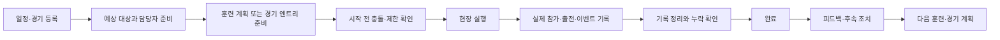

## 2. 일정 생성 분기

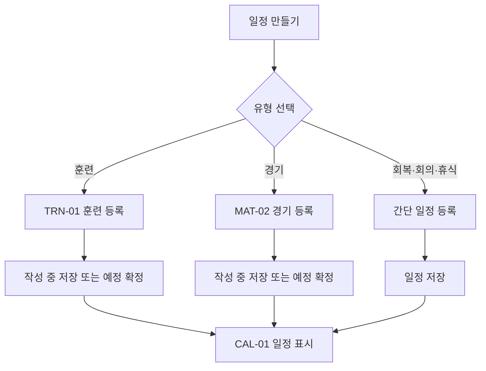

## 3. 훈련 등록·확정

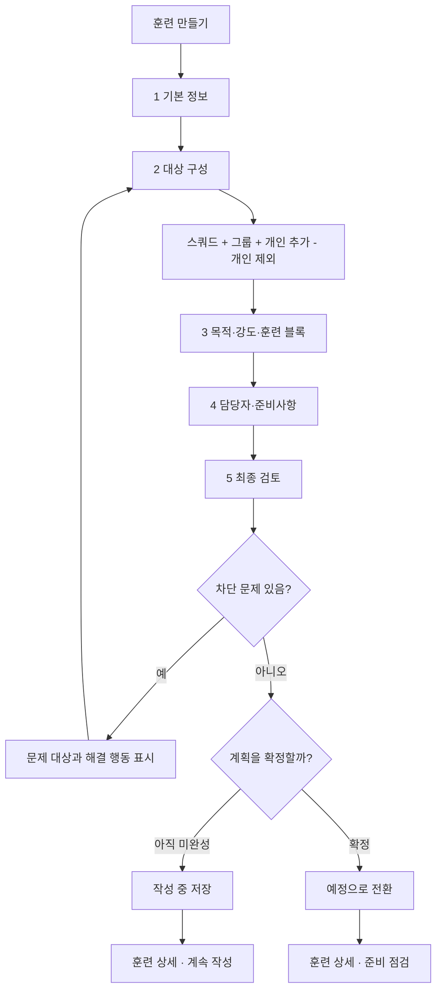

## 4. 훈련 시작 전·현장 운영

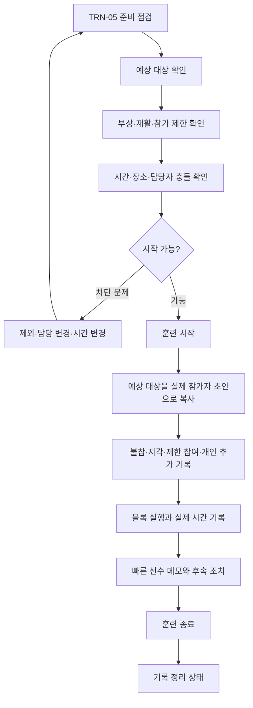

## 5. 훈련 기록 정리·완료

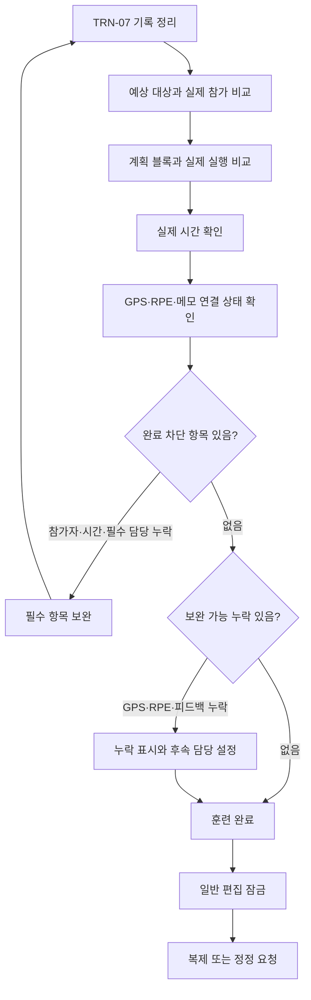

## 6. 훈련 변경·취소

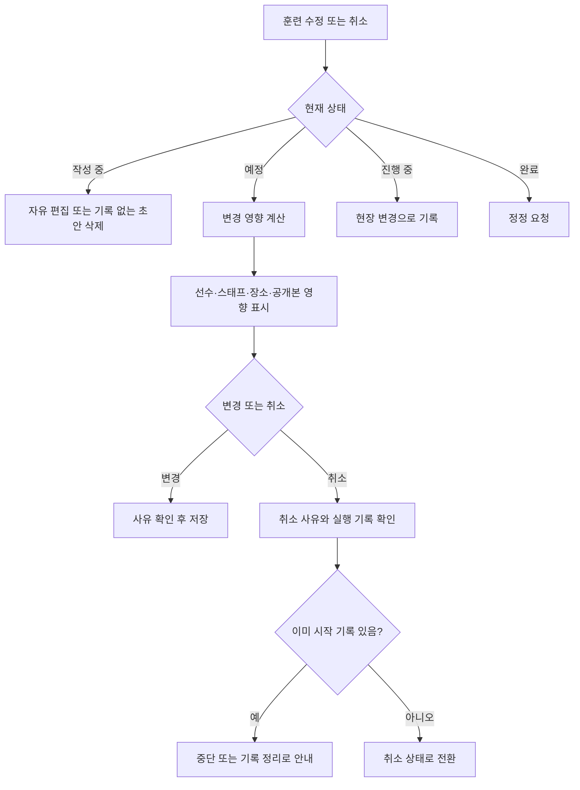

## 7. 경기 등록·중복 확인

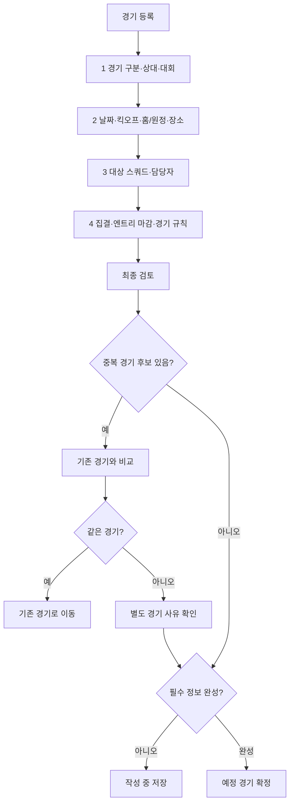

## 8. 경기 엔트리·라인업 준비

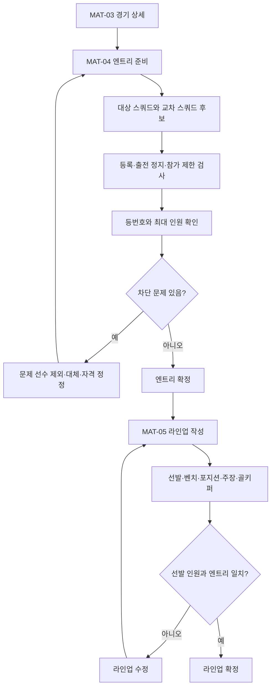

## 9. 경기 실행·결과 완료

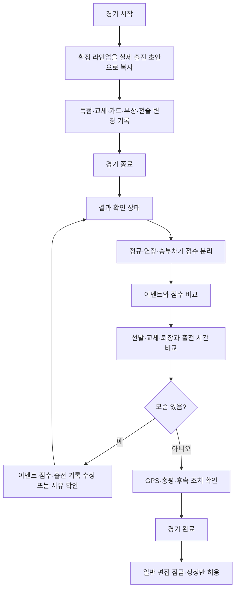

## 10. 경기 연기·취소·중단

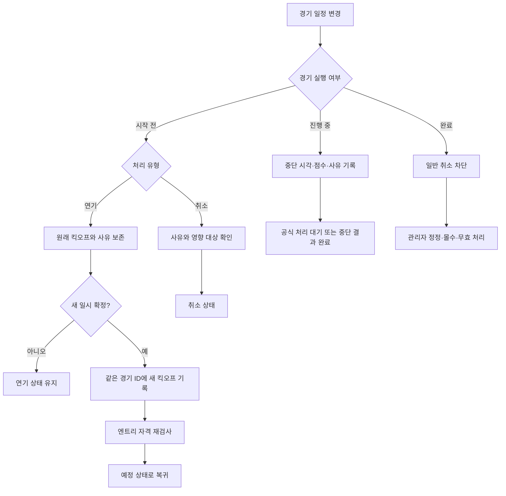

## 11. 동시 수정·저장 실패 복구

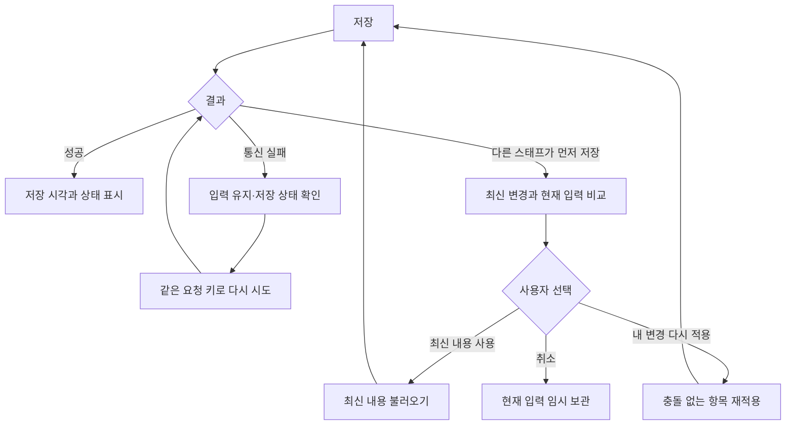

## 12. 화면 간 주요 이동

```text
CAL-01 일정
├─ 훈련 만들기 → TRN-01 → TRN-02
│  ├─ 참가자 → TRN-03
│  ├─ 훈련 계획 → TRN-04
│  ├─ 준비 점검 → TRN-05
│  ├─ 훈련 시작 → TRN-06
│  └─ 기록 확인 → TRN-07
└─ 경기 등록 → MAT-02 → MAT-03
   ├─ 엔트리 → MAT-04
   ├─ 라인업 → MAT-05
   ├─ 경기 기록 → MAT-06
   ├─ 결과 검토 → MAT-07
   └─ 완료 후 정정 → MAT-08

MAT-01 경기 목록 → MAT-03 경기 상세
TRN-08 템플릿 → TRN-01 훈련 등록
```

## 13. 플로우 검토 기준

1. 지도자가 정상 흐름에서 같은 정보를 두 번 입력하지 않는가
2. 작성 중 저장 후 정확한 단계로 돌아올 수 있는가
3. 예상 대상과 실제 참가자가 섞이지 않는가
4. 경기 엔트리·라인업·실제 출전이 서로 구분되는가
5. 게시 이후 삭제 대신 취소·연기·정정으로 이어지는가
6. 차단 오류에서 해결할 화면으로 바로 이동할 수 있는가
7. GPS·피드백 누락이 현장 완료를 불필요하게 막지 않는가
8. 동시 수정과 통신 실패에서 입력값이 유지되는가
